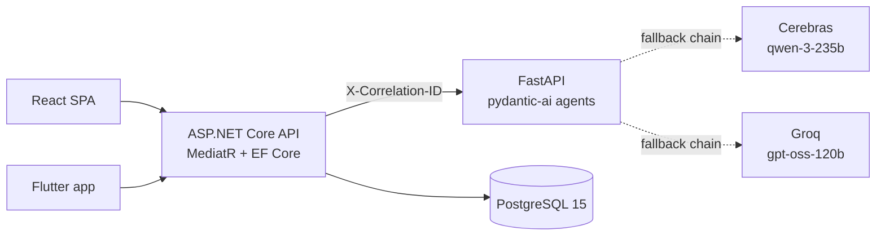
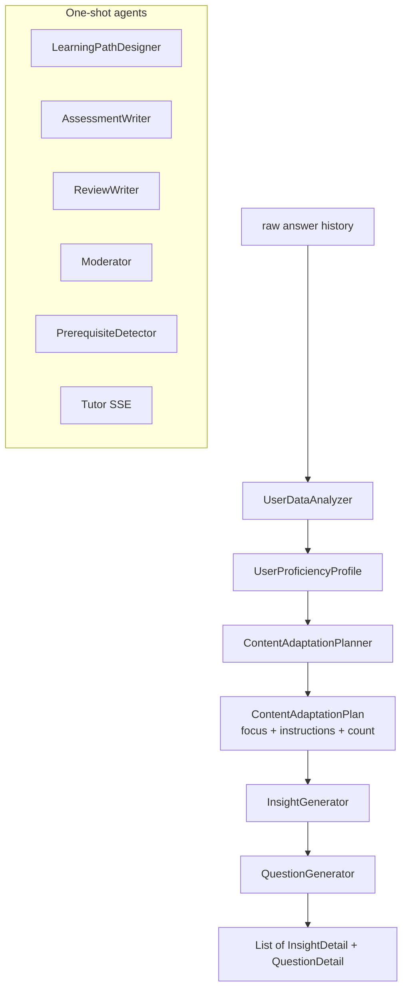

# adaptive-learning-platform-public-docs

**An adaptive learning platform driven by a multi-agent LLM pipeline.** A learner picks (or invents) a subject, takes a short diagnostic, and gets a personalised curriculum of micro-insights and questions. A Socratic tutor explains mistakes without giving away answers, and an SM-2 scheduler decides what to review and when.

Monorepo: ASP.NET Core backend, React web app, Flutter mobile app, and a FastAPI LLM microservice. All four services build and test in CI on every push.

> No public demo URL - the stack expects Postgres + an LLM provider. A one-command local run is documented below, and `LLM_MODE=mock` lets you try the full product without any API keys.

---

## Why this project exists

Most online courses are linear: every learner walks the same path at the same pace. People bounce off because the material is either too hard (frustrating) or too easy (boring), and they get no feedback on *why* they got something wrong.

Adaptive Learning Platform attacks this directly:

- **Diagnostic assessment** places the learner on a per-topic mastery curve before the first lesson.
- **Adaptive difficulty** - item selection is driven by a shared [`UserPerformanceAnalyzer`](backend/Backend.Application/) so quizzes, practice, and review all stay in the productive-struggle zone.
- **Spaced-repetition review (SRS)** surfaces what's about to be forgotten, not what was last seen.
- **AI tutor + insights** explain mistakes in plain language and recommend the next concept, using a provider-agnostic LLM service (Gemini / Groq / mock).
- **Custom domains** - learners can spin up their own subject via a moderated LLM pipeline instead of being limited to a fixed catalogue.

Adaptive Learning Platform is an experiment in making every piece of content - the curriculum, the difficulty, the micro-explanations, the tutor's tone - a function of what the learner has actually got right and wrong.

The interesting work is in [`llm/`](llm/): 10 typed `pydantic-ai` agents behind a FastAPI, with provider fallbacks, retry, throttling, and a reliability wrapper on the backend side. Everything below is in service of that.

---

## Architecture



| Service | Stack | Entry point |
|---|---|---|
| [backend/](backend/) | ASP.NET Core 9, MediatR/CQRS, EF Core, Serilog, JWT | [Program.cs](backend/Backend.Api/Program.cs) |
| [frontend/](frontend/) | React 19, Vite, MUI 7, `react-i18next` | [App.jsx](frontend/src/App.jsx) |
| [llm/](llm/) | Python 3.12, FastAPI, `pydantic-ai`, Pydantic v2 | [main.py](llm/app/main.py) |
| [mobile/neuropath/](mobile/neuropath/) | Flutter 3, Riverpod, `go_router`, Dio | [main.dart](mobile/neuropath/lib/main.dart) |

---

## The AI pipeline



Every agent has a Pydantic output schema - the LLM must return valid JSON for that schema or `pydantic-ai` retries. No string parsing anywhere.

| Agent | Output schema | Prompt |
|---|---|---|
| UserDataAnalyzer | `UserProficiencyProfile` | [llm_service.py:719](llm/app/services/llm_service.py#L719) |
| ContentAdaptationPlanner | `ContentAdaptationPlan` | [llm_service.py:737](llm/app/services/llm_service.py#L737) |
| LearningPathDesigner | `LearningPathResponse` | [llm_service.py:756](llm/app/services/llm_service.py#L756) |
| InsightGenerator | `List[InsightDetail]` | [llm_service.py:775](llm/app/services/llm_service.py#L775) |
| QuestionGenerator | `List[QuestionDetail]` (schema injected into prompt via `model_json_schema()`) | [llm_service.py:793](llm/app/services/llm_service.py#L793) |
| ReviewWriter | `ReviewResponse` | [llm_service.py:808](llm/app/services/llm_service.py#L808) |
| AssessmentWriter | `List[AssessmentGenerationQuestion]` | [llm_service.py:824](llm/app/services/llm_service.py#L824) |
| Moderator | `CustomDomainModerationResponse` | [llm_service.py:841](llm/app/services/llm_service.py#L841) |
| Tutor (JSON + SSE) | `str`, Socratic ruleset | [llm_service.py:865](llm/app/services/llm_service.py#L865) |
| PrerequisiteDetector | `List[PrerequisiteRecommendation]` | [llm_service.py:1259](llm/app/services/llm_service.py#L1259) |

**Reliability.** Two `FallbackModel` chains across Cerebras and Groq, agents split across them. `_run_agent_step` ([llm_service.py:356](llm/app/services/llm_service.py#L356)) retries 3x with backoff on `429/5xx` + `rate_limit_exceeded`, serialises real calls through an async lock, and logs `primary_model` vs `actual_model` so you can see in-flight provider fallovers. The backend then wraps each call again in [`AiIntegrationService`](backend/Backend.Infrastructure.Llm/AiIntegrationService.cs), tagging outcomes (`fallback_timeout`, `fallback_empty_response`, `fallback_invalid_dag`, …) and substituting heuristic content so a failed LLM never breaks a learner session.

**`LLM_MODE=mock`** returns deterministic responses in 6 languages; the whole stack - and the full test suite - runs without any third-party key.

---

## Evaluation

- **Contract fixtures** in [`docs/contracts/backend-llm/`](docs/contracts/backend-llm/) are replayed on *both* sides: [`BackendLlmContractTests`](backend/Backend.Tests.Integration/BackendLlmContractTests.cs) from C# and [`test_contract_fixtures.py`](llm/tests/test_contract_fixtures.py) from Python. A breaking schema change fails CI on both ends in the same push.
- **Failure-mode tests** - [`AiFailureTests`](backend/Backend.Tests.Integration/AiFailureTests.cs) forces empty bodies, timeouts, and exceptions from the LLM and asserts the backend's tagged fallbacks.
- **Deterministic pacing rules** - [`UserPerformanceAnalyzerTests`](backend/Backend.Tests.Unit/UserPerformanceAnalyzerTests.cs) pins the 4/6/8 insight-per-level decisions that feed into the adaptation prompt.
- **Tutor streaming** - [`test_tutor_chat.py`](llm/tests/test_tutor_chat.py) covers both the JSON and SSE paths.
- **Real-mode boot** - [`test_llm_service.py`](llm/tests/test_llm_service.py) verifies the fallback chain filters correctly when only some providers are configured.

LLM-as-judge evals are **not** in place yet - they are the natural next step for this repo.

---

## Running it

```bash
cp .env.example .env              # set POSTGRES_PASSWORD and JWT_SECRET
docker compose up --build
```

| | URL |
|---|---|
| Web        | http://localhost:3000 |
| API        | http://localhost:8080 (Swagger at `/swagger`) |
| LLM        | http://localhost:8000 (OpenAPI at `/docs`) |
| Postgres   | localhost:5432 |

Real generation:

```bash
export LLM_MODE=real
export CEREBRAS_API_KEY=...   # either key alone is enough;
export GROQ_API_KEY=...        # set both for the full fallback chain
```

Per-service dev loops: `dotnet run --project backend/Backend.Api`, `npm run dev` in [frontend/](frontend/), `uvicorn app.main:app --reload` in [llm/](llm/), `flutter run` in [mobile/neuropath/](mobile/neuropath/).

---

## Tests & CI

Every push runs [`service-ci-cd`](.github/workflows/docker-image.yml): tests each service, then builds and pushes Docker images for `backend`, `frontend`, and `llm`. Mobile has [its own pipelines](.github/workflows/) for CI, release candidates, and production releases.

| Surface | Layers | Command |
|---|---|---|
| LLM | pytest, contract fixtures, SSE streaming, provider-filter tests | `pytest` in `llm/` |
| Backend | unit, integration (40+ classes: AI failures, adaptive difficulty, SRS, contracts, DAG validator), architecture (layer rules) | `dotnet test backend/Backend.sln` |
| Frontend | Vitest unit, Vitest integration (MSW), Playwright E2E | `npm run test` / `npm run test:e2e` |
| Mobile | `flutter test`, integration, contract fixtures | `flutter analyze && flutter test` |

---

## Repo map

```
backend/                ASP.NET Core API (layered: Api / Application / Domain / Infrastructure.*)
  .../Llm/AiIntegrationService.cs             backend-side reliability wrapper
  .../Learning/Shared/UserPerformanceAnalyzer.cs   adaptive pacing rules
  .../Persistence/EfSpacedRepetitionService.cs     SM-2 scheduler
frontend/               React + Vite SPA
llm/                    FastAPI multi-agent service
  app/services/llm_service.py   agents, prompts, fallback chains, retry + throttle
  app/main.py                   routes, correlation-ID middleware, SSE tutor
mobile/neuropath/       Flutter app, feature-first under lib/features/
deploy/k8s/             Kubernetes manifests per service
deploy/observability/   Grafana dashboards + Prometheus alerts
docs/contracts/         Pinned backend-llm and mobile-backend JSON fixtures
```

---

## Scope and honesty

This is a portfolio project, not a shipped product. What's here because it teaches something real:

- Typed multi-agent orchestration with `pydantic-ai`, not one giant prompt.
- Real provider fallovers (Cerebras → Groq) with retry, backoff, and rate-limit handling - observable in logs.
- Dual-layer reliability: pydantic-ai retries inside the service, tagged heuristic fallbacks outside it.
- Contract fixtures asserted from both sides of the backend ↔ LLM boundary.
- End-to-end `X-Correlation-ID` from mobile to provider.

What isn't here: LLM-as-judge evaluation, a hosted demo, and load testing. Those are the honest next steps. 

License: [LICENSE.md](LICENSE.md).
